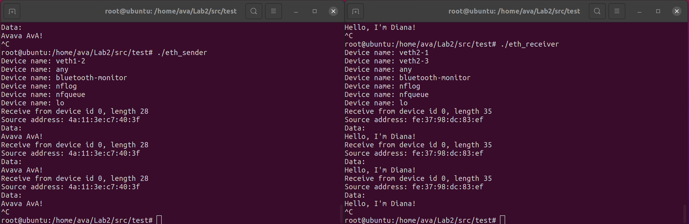
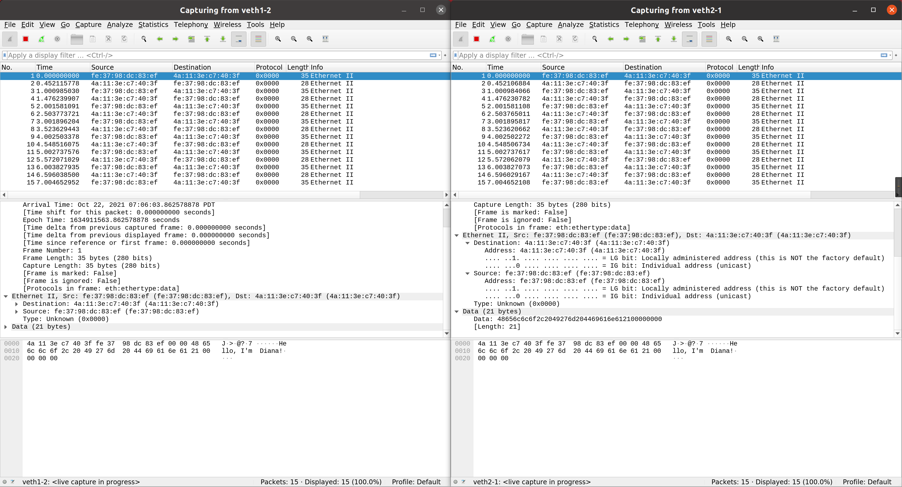

# CompNet Lab2

1900013039 邓朝萌

## Build

Build Libraries:

```bash
$ cd src
$ make clean
$ make
```

Build Libraries for debug:

```bash
$ cd src
$ make clean
$ make debug
```

Build testfiles(after build libraries):

```bash
$ cd src/test
$ make clean
$ make 
```


## 3.2 Link-layer: Packet I/O on Ethernet

### Programming Task 1 (PT1).

Finished.

### Programming Task 2 (PT2).

Finished.

### Checkpoint 1 (CP1).

I used `examples/example.txt` to build the vNet. I ran `./eth_reciever` on `ns2` and ran `./eth_sender` on `ns1`.

Here is the screenshots. They show that my implementation can detect network interfaces on the host.

You should use command `make debug` to build the libraries to show the device name in `initDevice()`.



### Checkpoint 2 (CP2).

I used `examples/example.txt` to build the vNet. I ran `./eth_reciever` on `ns2` and ran `./eth_sender` on `ns1`.

Here is the screenshots.



