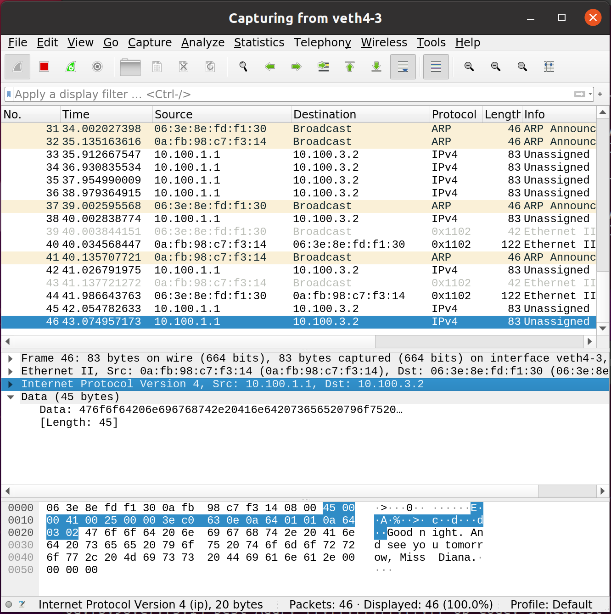
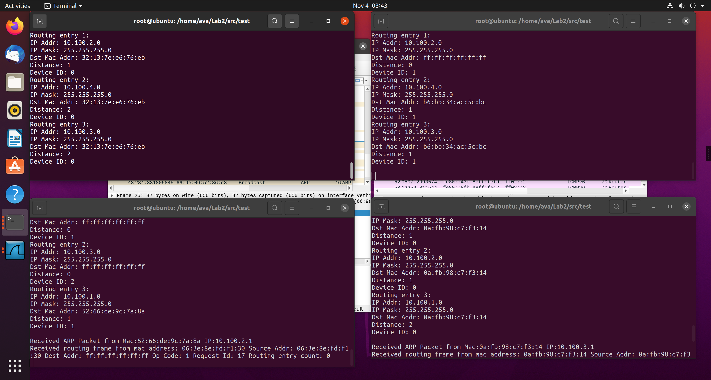
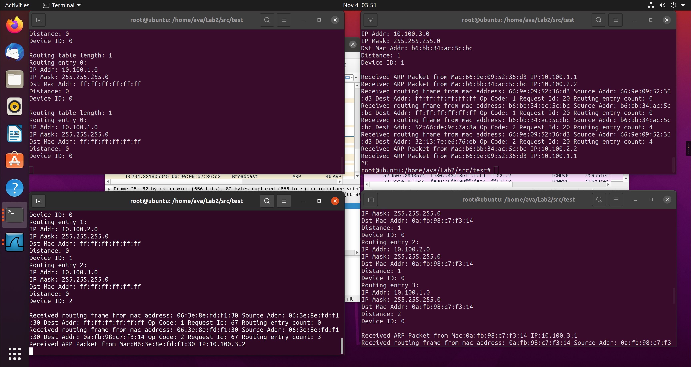

# CompNet Lab2

1900013039 邓朝萌

## Build

Build Libraries:

```bash
$ cd src
$ make clean
$ make
```

Build Libraries for debug:

```bash
$ cd src
$ make clean
$ make debug
```

Build testfiles(after build libraries):

```bash
$ cd src/test
$ make clean
$ make 
```


## 3.2 Link-layer: Packet I/O on Ethernet

### Programming Task 1 (PT1).

Finished.

### Programming Task 2 (PT2).

Finished.

### Checkpoint 1 (CP1).

I used `examples/example.txt` to build the vNet. I ran `./eth_reciever` on `ns2` and ran `./eth_sender` on `ns1`.

Here is the screenshots. They show that my implementation can detect network interfaces on the host.

You should use command `make debug` to build the libraries to show the device name in `initDevice()`, and modify the mac address in `eth_sender.c` to the MAC address of `veth2-1`.


### Checkpoint 2 (CP2).

I used `examples/example.txt` to build the vNet. I ran `./eth_reciever` on `ns2` and ran `./eth_sender` on `ns1`.

Here is the screenshots. 

Traces are dumped in `checkpoints/CP02`.


## 3.3 Network-layer: IP Protocol

### Programming Task 3 (PT3).

Finished.

### Writing Task 1 (WT1).

I implemented the ARP protocol supports broadcasting and request the MAC address. The ARP service broadcast its IP address and MAC address every 5 seconds. Other device in the same veth can receive the data and update the ARP table. When a device sends a IP packet to the device in same veth, it first query the ARP table to find out the MAC address corresponding to the IP address. If query failed, it will just broadcast the packet and broadcast a ARP request. Othervise, the next hop MAC address is in the routing table and the device can just send to it.

### Writing Task 2 (WT2).

I using the Distance Vector routing alogrithm. I defined the distance between two adjacent router is 1(like Routing Information Protocol). Routers send vectors every 10 seconds to adjacent routers. I use the "Split horizon, poison reverse" strategy at routing table updating to avoid the problems like "Count to infinity".

### Checkpoint 3 (CP3).

I used `examples/example.txt` to build the vNet. I ran `./router` on `ns2, ns3, ns4` and ran `./ip_sender` on `ns1`.
After some routing updating routine, `ns4` can receive the IP packets sent by `ns1`:



One captured IP packet is dumped here: 

```
45 00 00 41 00 25 00 00 3e c0 63 0e 0a 64 01 01 
0a 64 03 02 47 6f 6f 64 20 6e 69 67 68 74 2e 20 
41 6e 64 20 73 65 65 20 79 6f 75 20 74 6f 6d 6f 
72 72 6f 77 2c 20 4d 69 73 73 20 44 69 61 6e 61 
2e
```
The first byte is `0x45`, the most significant 4 bits of the first byte is `0100`, it is the version field. For IPv4, this is always equal to 4, the least significant 4 bits of the first byte is `0101`, it is the Internet Header Length, means the length of the IP header is `(5 << 2) = 20` bytes.

The 2nd byte is `0x00`, means the type of service (ToS) is `0x00`.

The 3rd-4th bytes is `0x00 0x41`, means the total length of the IP packet is `0x0041`.

The 5th-6th bytes is `0x00 0x25`, means the  identification field of the IP packet is `0x0025`.

The 7th-8th bytes is `0x00 0x00`, the most significant 3 bits of the 7th byte is `000`. The first bit is reversed to `0`. The second bit is `0`, means no Don't Fragment. The second bit is `0`, means no More Fragments. The rest bits is all `0`, means fragment offset is `0`.

The 9th byte is `0x3e`, means the Time to live (TTL) of the packet is `0x3e=62`. If this packet is forwarded 62 more hops, it will be dropped.

The 10th byte is `0xc0`, means the Protocol of the packet content is `0xc0`. It doesn't corresponds to any existing protocol.

The 11th-12th bytes is `0x63 0x0e`, means the header checksum of this packet is `0x630e`.

The 13th-16th bytes is `0x0a 0x64 0x01 0x01`, means the IPv4 address of the sender of the packet is `10.100.1.1`.

The 17th-20th bytes is `0x0a 0x64 0x03 0x02`, means the IPv4 address of the receiver of the packet is `10.100.3.2`.

The rest bytes is the IP packet contents. These bytes means a string `"Good night. And see you tomorrow, Miss Diana."`.

### Checkpoint 4 (CP4).

I used `examples/example.txt` to build the vNet.The network has the following topology:


`veth1-2, veth2-1` has ip address `10.100.1.0/24`, `veth2-3, veth3-2` has ip address `10.100.2.0/24`, `veth3-4, veth4-3` has ip address `10.100.3.0/24`, `veth4` has ip address `10.100.4.0/24`, 
 I ran `./router` on `ns1, ns2, ns3, ns4`, after some routing updating routine, the routing table in `ns1` is as following:

```
Routing table length: 4
Routing entry 0: 
IP Addr: 10.100.1.0
IP Mask: 255.255.255.0
Dst Mac Addr: ff:ff:ff:ff:ff:ff
Distance: 0
Device ID: 0
Routing entry 1: 
IP Addr: 10.100.2.0
IP Mask: 255.255.255.0
Dst Mac Addr: 32:13:7e:e6:76:eb
Distance: 1
Device ID: 0
Routing entry 2: 
IP Addr: 10.100.4.0
IP Mask: 255.255.255.0
Dst Mac Addr: 32:13:7e:e6:76:eb
Distance: 2
Device ID: 0
Routing entry 3: 
IP Addr: 10.100.3.0
IP Mask: 255.255.255.0
Dst Mac Addr: 32:13:7e:e6:76:eb
Distance: 2
Device ID: 0
```
The topleft terminal is running in `ns1`.


Then stop the `./router` in `ns2`, after some routing updating routine, the routing table in `ns1` is as following:
```
Routing table length: 1
Routing entry 0: 
IP Addr: 10.100.1.0
IP Mask: 255.255.255.0
Dst Mac Addr: ff:ff:ff:ff:ff:ff
Distance: 0
Device ID: 0
```
The topright terminal is running in `ns2`.


Then run `./router` in `ns2`, after some routing updating routine, the routing table in `ns1` is as following:

```
Routing table length: 4
Routing entry 0: 
IP Addr: 10.100.1.0
IP Mask: 255.255.255.0
Dst Mac Addr: ff:ff:ff:ff:ff:ff
Distance: 0
Device ID: 0
Routing entry 1: 
IP Addr: 10.100.2.0
IP Mask: 255.255.255.0
Dst Mac Addr: 32:13:7e:e6:76:eb
Distance: 1
Device ID: 0
Routing entry 2: 
IP Addr: 10.100.4.0
IP Mask: 255.255.255.0
Dst Mac Addr: 32:13:7e:e6:76:eb
Distance: 2
Device ID: 0
Routing entry 3: 
IP Addr: 10.100.3.0
IP Mask: 255.255.255.0
Dst Mac Addr: 32:13:7e:e6:76:eb
Distance: 2
Device ID: 0
```