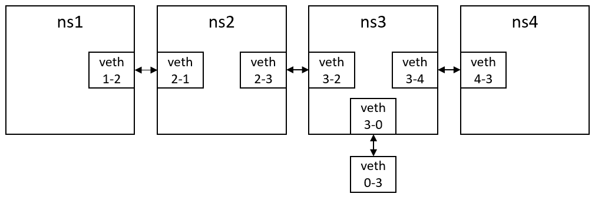

# CompNet Lab2

1900013039 邓朝萌

## Build

Build Libraries:

```bash
$ cd src
$ make clean
$ make
```

Build Libraries for debug:

```bash
$ cd src
$ make clean
$ make debug
```

Build testfiles(after build libraries):

```bash
$ cd src/test
$ make clean
$ make 
```


## 3.2 Link-layer: Packet I/O on Ethernet

### Programming Task 1 (PT1).

Finished.

### Programming Task 2 (PT2).

Finished.

### Checkpoint 1 (CP1).

I used `examples/example.txt` to build the vNet. I ran `./eth_reciever` on `ns2` and ran `./eth_sender` on `ns1`.

Here is the screenshots. They show that my implementation can detect network interfaces on the host.

You should use command `make debug` to build the libraries to show the device name in `initDevice()`, and modify the mac address in `eth_sender.c` to the MAC address of `veth2-1`.


### Checkpoint 2 (CP2).

I used `examples/example.txt` to build the vNet. I ran `./eth_reciever` on `ns2` and ran `./eth_sender` on `ns1`.

Here is the screenshots. 

Traces are dumped in `checkpoints/CP02`.


## 3.3 Network-layer: IP Protocol

### Programming Task 3 (PT3).

Finished.

### Writing Task 1 (WT1).

I implemented the ARP protocol supports broadcasting and request the MAC address. The ARP service broadcast its IP address and MAC address every 5 seconds. Other device in the same veth can receive the data and update the ARP table. When a device sends a IP packet to the device in same veth, it first query the ARP table to find out the MAC address corresponding to the IP address. If query failed, it will just broadcast the packet and broadcast a ARP request. Othervise, the next hop MAC address is in the routing table and the device can just send to it.

### Writing Task 2 (WT2).

I using the Distance Vector routing alogrithm. I defined the distance between two adjacent router is 1(like Routing Information Protocol). Routers send vectors every 10 seconds to adjacent routers. I use the "Split horizon, poison reverse" strategy at routing table updating to avoid the problems like "Count to infinity".

### Checkpoint 3 (CP3).

I used `examples/example.txt` to build the vNet. I ran `./router` on `ns2, ns3, ns4` and ran `./ip_sender` on `ns1`.
After some routing updating routine, `ns4` can receive the IP packets sent by `ns1`:


One captured IP packet is dumped here: 

```
45 00 00 41 00 25 00 00 3e c0 63 0e 0a 64 01 01 
0a 64 03 02 47 6f 6f 64 20 6e 69 67 68 74 2e 20 
41 6e 64 20 73 65 65 20 79 6f 75 20 74 6f 6d 6f 
72 72 6f 77 2c 20 4d 69 73 73 20 44 69 61 6e 61 
2e
```
The first byte is `0x45`, the most significant 4 bits of the first byte is `0100`, it is the version field. For IPv4, this is always equal to 4, the least significant 4 bits of the first byte is `0101`, it is the Internet Header Length, means the length of the IP header is `(5 << 2) = 20` bytes.

The 2nd byte is `0x00`, means the type of service (ToS) is `0x00`.

The 3rd-4th bytes is `0x00 0x41`, means the total length of the IP packet is `0x0041`.

The 5th-6th bytes is `0x00 0x25`, means the  identification field of the IP packet is `0x0025`.

The 7th-8th bytes is `0x00 0x00`, the most significant 3 bits of the 7th byte is `000`. The first bit is reversed to `0`. The second bit is `0`, means no Don't Fragment. The second bit is `0`, means no More Fragments. The rest bits is all `0`, means fragment offset is `0`.

The 9th byte is `0x3e`, means the Time to live (TTL) of the packet is `0x3e=62`. If this packet is forwarded 62 more hops, it will be dropped.

The 10th byte is `0xc0`, means the Protocol of the packet content is `0xc0`. It doesn't corresponds to any existing protocol.

The 11th-12th bytes is `0x63 0x0e`, means the header checksum of this packet is `0x630e`.

The 13th-16th bytes is `0x0a 0x64 0x01 0x01`, means the IPv4 address of the sender of the packet is `10.100.1.1`.

The 17th-20th bytes is `0x0a 0x64 0x03 0x02`, means the IPv4 address of the receiver of the packet is `10.100.3.2`.

The rest bytes is the IP packet contents. These bytes means a string `"Good night. And see you tomorrow, Miss Diana."`.

### Checkpoint 4 (CP4).

I used `examples/example.txt` to build the vNet.The network has the following topology:



`veth1-2, veth2-1` has ip address `10.100.1.0/24`, `veth2-3, veth3-2` has ip address `10.100.2.0/24`, `veth3-4, veth4-3` has ip address `10.100.3.0/24`, `veth3-0` has ip address `10.100.4.0/24`, 
 I ran `./router` on `ns1, ns2, ns3, ns4`, after some routing updating routine, the routing table in `ns1` is as following:

```
Routing table length: 4
Routing entry 0: 
IP Addr: 10.100.1.0
IP Mask: 255.255.255.0
Dst Mac Addr: ff:ff:ff:ff:ff:ff
Distance: 0
Device ID: 0
Routing entry 1: 
IP Addr: 10.100.2.0
IP Mask: 255.255.255.0
Dst Mac Addr: 32:13:7e:e6:76:eb
Distance: 1
Device ID: 0
Routing entry 2: 
IP Addr: 10.100.4.0
IP Mask: 255.255.255.0
Dst Mac Addr: 32:13:7e:e6:76:eb
Distance: 2
Device ID: 0
Routing entry 3: 
IP Addr: 10.100.3.0
IP Mask: 255.255.255.0
Dst Mac Addr: 32:13:7e:e6:76:eb
Distance: 2
Device ID: 0
```
The topleft terminal is running in `ns1`.


Then stop the `./router` in `ns2`, after some routing updating routine, the routing table in `ns1` is as following:
```
Routing table length: 1
Routing entry 0: 
IP Addr: 10.100.1.0
IP Mask: 255.255.255.0
Dst Mac Addr: ff:ff:ff:ff:ff:ff
Distance: 0
Device ID: 0
```
The topright terminal is running in `ns2`.


Then run `./router` in `ns2`, after some routing updating routine, the routing table in `ns1` is as following:

```
Routing table length: 4
Routing entry 0: 
IP Addr: 10.100.1.0
IP Mask: 255.255.255.0
Dst Mac Addr: ff:ff:ff:ff:ff:ff
Distance: 0
Device ID: 0
Routing entry 1: 
IP Addr: 10.100.2.0
IP Mask: 255.255.255.0
Dst Mac Addr: 32:13:7e:e6:76:eb
Distance: 1
Device ID: 0
Routing entry 2: 
IP Addr: 10.100.4.0
IP Mask: 255.255.255.0
Dst Mac Addr: 32:13:7e:e6:76:eb
Distance: 2
Device ID: 0
Routing entry 3: 
IP Addr: 10.100.3.0
IP Mask: 255.255.255.0
Dst Mac Addr: 32:13:7e:e6:76:eb
Distance: 2
Device ID: 0
```

### Checkpoint 5 (CP5).

I used `checkpoint/CP05/vnet.txt` to build the vNet.The network has the following topology:

```
ns1 --- ns2 --- ns3 --- ns4
        |       |
        ns5 --- ns6
```

`veth1-2, veth2-1` has ip address `10.100.1.0/24`, `veth2-3, veth3-2` has ip address `10.100.2.0/24`, `veth3-4, veth4-3` has ip address `10.100.3.0/24`, `veth2-5, veth5-2` has ip address `10.100.4.0/24`, `veth5-6, veth6-5` has ip address `10.100.5.0/24`, `veth6-3, veth3-6` has ip address `10.100.6.0/24`.

I ran `./router` on `ns1, ns2, ns3, ns4, ns5, ns6`, after some routing updating routine, the routing table is as following:

```
# ns1
Routing table length: 6
Routing entry 0: 
IP Addr: 10.100.1.0
IP Mask: 255.255.255.0
Dst Mac Addr: ff:ff:ff:ff:ff:ff
Distance: 0
Device ID: 0
Routing entry 1: 
IP Addr: 10.100.2.0
IP Mask: 255.255.255.0
Dst Mac Addr: ee:a6:29:c7:19:37
Distance: 1
Device ID: 0
Routing entry 2: 
IP Addr: 10.100.4.0
IP Mask: 255.255.255.0
Dst Mac Addr: ee:a6:29:c7:19:37
Distance: 1
Device ID: 0
Routing entry 3: 
IP Addr: 10.100.3.0
IP Mask: 255.255.255.0
Dst Mac Addr: ee:a6:29:c7:19:37
Distance: 2
Device ID: 0
Routing entry 4: 
IP Addr: 10.100.6.0
IP Mask: 255.255.255.0
Dst Mac Addr: ee:a6:29:c7:19:37
Distance: 2
Device ID: 0
Routing entry 5: 
IP Addr: 10.100.5.0
IP Mask: 255.255.255.0
Dst Mac Addr: ee:a6:29:c7:19:37
Distance: 2
Device ID: 0

# ns2

Routing table length: 6
Routing entry 0: 
IP Addr: 10.100.1.0
IP Mask: 255.255.255.0
Dst Mac Addr: ff:ff:ff:ff:ff:ff
Distance: 0
Device ID: 0
Routing entry 1: 
IP Addr: 10.100.2.0
IP Mask: 255.255.255.0
Dst Mac Addr: ff:ff:ff:ff:ff:ff
Distance: 0
Device ID: 1
Routing entry 2: 
IP Addr: 10.100.4.0
IP Mask: 255.255.255.0
Dst Mac Addr: ff:ff:ff:ff:ff:ff
Distance: 0
Device ID: 2
Routing entry 3: 
IP Addr: 10.100.3.0
IP Mask: 255.255.255.0
Dst Mac Addr: 6e:af:70:0a:5b:b8
Distance: 1
Device ID: 1
Routing entry 4: 
IP Addr: 10.100.6.0
IP Mask: 255.255.255.0
Dst Mac Addr: 6e:af:70:0a:5b:b8
Distance: 1
Device ID: 1
Routing entry 5: 
IP Addr: 10.100.5.0
IP Mask: 255.255.255.0
Dst Mac Addr: 8e:4b:75:73:75:fb
Distance: 1
Device ID: 2

# ns3

Routing table length: 6
Routing entry 0: 
IP Addr: 10.100.2.0
IP Mask: 255.255.255.0
Dst Mac Addr: ff:ff:ff:ff:ff:ff
Distance: 0
Device ID: 0
Routing entry 1: 
IP Addr: 10.100.3.0
IP Mask: 255.255.255.0
Dst Mac Addr: ff:ff:ff:ff:ff:ff
Distance: 0
Device ID: 1
Routing entry 2: 
IP Addr: 10.100.6.0
IP Mask: 255.255.255.0
Dst Mac Addr: ff:ff:ff:ff:ff:ff
Distance: 0
Device ID: 2
Routing entry 3: 
IP Addr: 10.100.1.0
IP Mask: 255.255.255.0
Dst Mac Addr: ae:b6:eb:c1:d1:44
Distance: 1
Device ID: 0
Routing entry 4: 
IP Addr: 10.100.4.0
IP Mask: 255.255.255.0
Dst Mac Addr: ae:b6:eb:c1:d1:44
Distance: 1
Device ID: 0
Routing entry 5: 
IP Addr: 10.100.5.0
IP Mask: 255.255.255.0
Dst Mac Addr: ee:8c:26:5f:bb:bc
Distance: 1
Device ID: 2

# ns4 

Routing table length: 6
Routing entry 0: 
IP Addr: 10.100.3.0
IP Mask: 255.255.255.0
Dst Mac Addr: ff:ff:ff:ff:ff:ff
Distance: 0
Device ID: 0
Routing entry 1: 
IP Addr: 10.100.2.0
IP Mask: 255.255.255.0
Dst Mac Addr: 8a:f7:2e:48:e8:aa
Distance: 1
Device ID: 0
Routing entry 2: 
IP Addr: 10.100.6.0
IP Mask: 255.255.255.0
Dst Mac Addr: 8a:f7:2e:48:e8:aa
Distance: 1
Device ID: 0
Routing entry 3: 
IP Addr: 10.100.1.0
IP Mask: 255.255.255.0
Dst Mac Addr: 8a:f7:2e:48:e8:aa
Distance: 2
Device ID: 0
Routing entry 4: 
IP Addr: 10.100.4.0
IP Mask: 255.255.255.0
Dst Mac Addr: 8a:f7:2e:48:e8:aa
Distance: 2
Device ID: 0
Routing entry 5: 
IP Addr: 10.100.5.0
IP Mask: 255.255.255.0
Dst Mac Addr: 8a:f7:2e:48:e8:aa
Distance: 2
Device ID: 0

# ns5

Routing table length: 6
Routing entry 0: 
IP Addr: 10.100.4.0
IP Mask: 255.255.255.0
Dst Mac Addr: ff:ff:ff:ff:ff:ff
Distance: 0
Device ID: 0
Routing entry 1: 
IP Addr: 10.100.5.0
IP Mask: 255.255.255.0
Dst Mac Addr: ff:ff:ff:ff:ff:ff
Distance: 0
Device ID: 1
Routing entry 2: 
IP Addr: 10.100.1.0
IP Mask: 255.255.255.0
Dst Mac Addr: fe:5e:f9:7d:5c:39
Distance: 1
Device ID: 0
Routing entry 3: 
IP Addr: 10.100.2.0
IP Mask: 255.255.255.0
Dst Mac Addr: fe:5e:f9:7d:5c:39
Distance: 1
Device ID: 0
Routing entry 4: 
IP Addr: 10.100.3.0
IP Mask: 255.255.255.0
Dst Mac Addr: fe:5e:f9:7d:5c:39
Distance: 2
Device ID: 0
Routing entry 5: 
IP Addr: 10.100.6.0
IP Mask: 255.255.255.0
Dst Mac Addr: 1a:34:9a:36:76:ec
Distance: 1
Device ID: 1

# ns6

Routing table length: 6
Routing entry 0: 
IP Addr: 10.100.6.0
IP Mask: 255.255.255.0
Dst Mac Addr: ff:ff:ff:ff:ff:ff
Distance: 0
Device ID: 0
Routing entry 1: 
IP Addr: 10.100.5.0
IP Mask: 255.255.255.0
Dst Mac Addr: ff:ff:ff:ff:ff:ff
Distance: 0
Device ID: 1
Routing entry 2: 
IP Addr: 10.100.2.0
IP Mask: 255.255.255.0
Dst Mac Addr: 22:14:15:fb:3a:ef
Distance: 1
Device ID: 0
Routing entry 3: 
IP Addr: 10.100.3.0
IP Mask: 255.255.255.0
Dst Mac Addr: 22:14:15:fb:3a:ef
Distance: 1
Device ID: 0
Routing entry 4: 
IP Addr: 10.100.1.0
IP Mask: 255.255.255.0
Dst Mac Addr: 22:14:15:fb:3a:ef
Distance: 2
Device ID: 0
Routing entry 5: 
IP Addr: 10.100.4.0
IP Mask: 255.255.255.0
Dst Mac Addr: d2:1e:9e:2d:97:c2
Distance: 1
Device ID: 1
```
The topleft terminal is running in `ns1`, the topmid terminal is running in `ns2`, etc.


After stop the `./router` in `ns5`, the routing table is as following:

```
# ns1

Routing table length: 6
Routing entry 0: 
IP Addr: 10.100.1.0
IP Mask: 255.255.255.0
Dst Mac Addr: ff:ff:ff:ff:ff:ff
Distance: 0
Device ID: 0
Routing entry 1: 
IP Addr: 10.100.2.0
IP Mask: 255.255.255.0
Dst Mac Addr: ee:a6:29:c7:19:37
Distance: 1
Device ID: 0
Routing entry 2: 
IP Addr: 10.100.4.0
IP Mask: 255.255.255.0
Dst Mac Addr: ee:a6:29:c7:19:37
Distance: 1
Device ID: 0
Routing entry 3: 
IP Addr: 10.100.3.0
IP Mask: 255.255.255.0
Dst Mac Addr: ee:a6:29:c7:19:37
Distance: 2
Device ID: 0
Routing entry 4: 
IP Addr: 10.100.6.0
IP Mask: 255.255.255.0
Dst Mac Addr: ee:a6:29:c7:19:37
Distance: 2
Device ID: 0
Routing entry 5: 
IP Addr: 10.100.5.0
IP Mask: 255.255.255.0
Dst Mac Addr: ee:a6:29:c7:19:37
Distance: 3
Device ID: 0

# ns2

Routing table length: 6
Routing entry 0: 
IP Addr: 10.100.1.0
IP Mask: 255.255.255.0
Dst Mac Addr: ff:ff:ff:ff:ff:ff
Distance: 0
Device ID: 0
Routing entry 1: 
IP Addr: 10.100.2.0
IP Mask: 255.255.255.0
Dst Mac Addr: ff:ff:ff:ff:ff:ff
Distance: 0
Device ID: 1
Routing entry 2: 
IP Addr: 10.100.4.0
IP Mask: 255.255.255.0
Dst Mac Addr: ff:ff:ff:ff:ff:ff
Distance: 0
Device ID: 2
Routing entry 3: 
IP Addr: 10.100.3.0
IP Mask: 255.255.255.0
Dst Mac Addr: 6e:af:70:0a:5b:b8
Distance: 1
Device ID: 1
Routing entry 4: 
IP Addr: 10.100.6.0
IP Mask: 255.255.255.0
Dst Mac Addr: 6e:af:70:0a:5b:b8
Distance: 1
Device ID: 1
Routing entry 5: 
IP Addr: 10.100.5.0
IP Mask: 255.255.255.0
Dst Mac Addr: 6e:af:70:0a:5b:b8
Distance: 2
Device ID: 1

# ns3

Routing table length: 6
Routing entry 0: 
IP Addr: 10.100.2.0
IP Mask: 255.255.255.0
Dst Mac Addr: ff:ff:ff:ff:ff:ff
Distance: 0
Device ID: 0
Routing entry 1: 
IP Addr: 10.100.3.0
IP Mask: 255.255.255.0
Dst Mac Addr: ff:ff:ff:ff:ff:ff
Distance: 0
Device ID: 1
Routing entry 2: 
IP Addr: 10.100.6.0
IP Mask: 255.255.255.0
Dst Mac Addr: ff:ff:ff:ff:ff:ff
Distance: 0
Device ID: 2
Routing entry 3: 
IP Addr: 10.100.1.0
IP Mask: 255.255.255.0
Dst Mac Addr: ae:b6:eb:c1:d1:44
Distance: 1
Device ID: 0
Routing entry 4: 
IP Addr: 10.100.4.0
IP Mask: 255.255.255.0
Dst Mac Addr: ae:b6:eb:c1:d1:44
Distance: 1
Device ID: 0
Routing entry 5: 
IP Addr: 10.100.5.0
IP Mask: 255.255.255.0
Dst Mac Addr: ee:8c:26:5f:bb:bc
Distance: 1
Device ID: 2

# ns4

Routing table length: 6
Routing entry 0: 
IP Addr: 10.100.3.0
IP Mask: 255.255.255.0
Dst Mac Addr: ff:ff:ff:ff:ff:ff
Distance: 0
Device ID: 0
Routing entry 1: 
IP Addr: 10.100.2.0
IP Mask: 255.255.255.0
Dst Mac Addr: 8a:f7:2e:48:e8:aa
Distance: 1
Device ID: 0
Routing entry 2: 
IP Addr: 10.100.6.0
IP Mask: 255.255.255.0
Dst Mac Addr: 8a:f7:2e:48:e8:aa
Distance: 1
Device ID: 0
Routing entry 3: 
IP Addr: 10.100.1.0
IP Mask: 255.255.255.0
Dst Mac Addr: 8a:f7:2e:48:e8:aa
Distance: 2
Device ID: 0
Routing entry 4: 
IP Addr: 10.100.4.0
IP Mask: 255.255.255.0
Dst Mac Addr: 8a:f7:2e:48:e8:aa
Distance: 2
Device ID: 0
Routing entry 5: 
IP Addr: 10.100.5.0
IP Mask: 255.255.255.0
Dst Mac Addr: 8a:f7:2e:48:e8:aa
Distance: 2
Device ID: 0

# ns6

Routing table length: 6
Routing entry 0: 
IP Addr: 10.100.6.0
IP Mask: 255.255.255.0
Dst Mac Addr: ff:ff:ff:ff:ff:ff
Distance: 0
Device ID: 0
Routing entry 1: 
IP Addr: 10.100.5.0
IP Mask: 255.255.255.0
Dst Mac Addr: ff:ff:ff:ff:ff:ff
Distance: 0
Device ID: 1
Routing entry 2: 
IP Addr: 10.100.2.0
IP Mask: 255.255.255.0
Dst Mac Addr: 22:14:15:fb:3a:ef
Distance: 1
Device ID: 0
Routing entry 3: 
IP Addr: 10.100.3.0
IP Mask: 255.255.255.0
Dst Mac Addr: 22:14:15:fb:3a:ef
Distance: 1
Device ID: 0
Routing entry 4: 
IP Addr: 10.100.1.0
IP Mask: 255.255.255.0
Dst Mac Addr: 22:14:15:fb:3a:ef
Distance: 2
Device ID: 0
Routing entry 5: 
IP Addr: 10.100.4.0
IP Mask: 255.255.255.0
Dst Mac Addr: 22:14:15:fb:3a:ef
Distance: 2
Device ID: 0
```


### Checkpoint 6 (CP6).


I used `checkpoint/CP06/vnet.txt` to build the vNet.The network has the following topology:

```
ns1 --- ns2 --- ns3 --- ns4
        |       
        ns5
```

`veth1-2, veth2-1` has ip address `10.100.1.0/24`, `veth2-3, veth3-2` has ip address `10.100.2.0/24`, `veth3-4, veth4-3` has ip address `10.100.3.0/24`, `veth2-5, veth5-2` has ip address `10.100.4.0/24`.

I ran `./router` on `ns3, ns4, ns5`, ran `./router_2` on `ns2`, ran `./ip_sender` on `ns1`. 
`./router_2` is a common `./router` with manually setting up the routing table that packet with "dest ip:0.0.0.0, mask:0.0.0.0" will be forwarded to `ns5`.
After some routing updating routine, the routing table of `ns2` is as following:

```
Routing table length: 5
Routing entry 0: 
IP Addr: 10.100.1.0
IP Mask: 255.255.255.0
Dst Mac Addr: ff:ff:ff:ff:ff:ff
Distance: 0
Device ID: 0
Routing entry 1: 
IP Addr: 10.100.2.0
IP Mask: 255.255.255.0
Dst Mac Addr: ff:ff:ff:ff:ff:ff
Distance: 0
Device ID: 1
Routing entry 2: 
IP Addr: 10.100.4.0
IP Mask: 255.255.255.0
Dst Mac Addr: ff:ff:ff:ff:ff:ff
Distance: 0
Device ID: 2
Routing entry 3: 
IP Addr: 0.0.0.0
IP Mask: 0.0.0.0
Dst Mac Addr: ff:ff:ff:ff:ff:ff
Distance: 0
Device ID: 2
Routing entry 4: 
IP Addr: 10.100.3.0
IP Mask: 255.255.255.0
Dst Mac Addr: 8e:8c:a0:b7:8c:c9
Distance: 1
Device ID: 1
```

`./ip_sender` in `ns1` send packet to `10.100.3.2` at `ns4`. When the packet arrived at `ns2`, `ns2` print the message below which showed the `ns2` forwarded the ip packet applying the "longest prefix matching" rule:

```
Forward IP Packet Form Src 10.100.1.1, Dst 10.100.3.2, TTL=63, Next Hop MAC: 8e:8c:a0:b7:8c:c9 Len=65
```

And we can see `ns4` successfully received the packet with correct TTL:


## 3.4 Transport-layer: TCP Protocol

### Programming Task 4 (PT4).

Finished. (`__wrap_getaddrinfo` is implemented by call built-in `getaddrinfo` directly)

### Writing Task 3 (WT3).

- I use a `struct socket_info_t` to save all the information about a socket. The `struct socket_info_t` records each socket's state, type, addr, port, etc. 
- When user program call `socket`, the protocol stack alloc a new empty `CLOSE` socket. When user program call `bind`, the protocol stack set some information of the socket and change the socket state to `BINDED`. 
- When user program call `listen`, the protocol stack set some information of the socket and change the socket state to `LISTEN`. 
- When user program call `connect`, the protocol stack set some information of the socket, change the socket state to `SYN_SENT`, and send a `SYN` segment to the server. 
- When the server receives a `SYN` segment, the corresponding `LISTEN` socket add the connection to a waiting list. - When user program call `accept`, if there is a connection in a waiting list, the protocol stack alloc a new data socket, change the socket state to `SYN_RECV`, and send a `SYNACK` segment to the client. the protocol stack will wait a new `SYN` segment of the accepting socket if the waiting list is empty.
- When the client receives a `SYNACK` segment of the connecting socket, the protocol stack change the socket state to `ESTABLISHED`, and send a `ACK` segment to the server. 
- When the client receives a `ACK` segment of a `SYN_RECV` socket, the protocol stack change the socket state to `ESTABLISHED`.
- When user program call `read`, the protocol stack will wait for the input ring buffer and send as most data as it can read data from the input buffer to the user program. 
- When user program call `write`, the protocol stack will wait for the freespace of the output ring buffer and read as most data as it can write data to the output buffer from the user program, then write the data into the output buffer.
- When user program call `close`, the protocol stack will set some information of the socket, change the socket state to `FIN_WAIT1`, send a `FIN` segment to the remote.
- When the client/server receives a `FIN` segment of a socket, the protocol stack change the socket state to `CLOSE_WAIT`, send a `FIN ACK` segment to the remote, to wait for all data to be sent.
- When the client/server sent all of the data of a  `CLOSE_WAIT` socket, the protocol stack change the socket state to `LAST_ACK` and send a `FIN` segment to the remote.
- When the client/server receives a `ACK` segment of a `FIN_WAIT1` socket, the protocol stack change the socket state to `FIN_WAIT2`, and write data of the socket is no longer allowed.
- When the client/server receives a `FIN` segment of a `FIN_WAIT2` socket, the protocol stack change the socket state to `TIME_WAIT`, send a `FIN ACK` segment to the remote, wait a long time for all packets to be die out, the close the socket.
- When the client/server receives a `ACK` segment of a `LAST_ACK` socket, the protocol stack close the socket.

### Checkpoint 7 (CP7).

I used `examples/example.txt` to build the vNet.The network has the following topology:


`veth1-2, veth2-1` has ip address `10.100.1.0/24`, `veth2-3, veth3-2` has ip address `10.100.2.0/24`, `veth3-4, veth4-3` has ip address `10.100.3.0/24`, `veth3-0` has ip address `10.100.4.0/24`, 
I ran `./router` on `ns2, ns3` for IP layer routing/forwarding and `./tcp_protocol_stack` `ns1, ns4` to support socket API.

I ran `./tcp_server` on `ns1` and `./tcp_client` on `ns4`. The `./tcp_client` send a high resolution `diana.png` to the `./tcp_server` and `./tcp_server` download it.


The packet captured by wireshark in `ns1` is saved at `checkpoints/CP07/cp07.pcapng`

I choose the `#100` packet. The TCP header is here:

```
0000   c3 50 04 63 00 00 e6 a9 00 00 00 02 50 10 7f ff
0010   85 56 00 00
```

- The first `2` byte is `c3 50`, means the source port is `50000`.
- The `3rd-4th` byte is `04 63`, means the destination port is `1123`.
- The `5-8th` byte is `00 00 e6 a9`, means the raw sequence number is `59049`.

- The `9-12th` byte is `00 00 00 02`, means the raw ack number is `2`.

- The `13-14th` byte is `50 10`. The first 4 bit is `0101`, means the TCP header length is `5 * 4 = 20`. The next 12 bit is flag bits, only the ACK bit is `1`. means it is an ACK segment.


```
000. .... .... = Reserved: Not set
...0 .... .... = Nonce: Not set
.... 0... .... = Congestion Window Reduced (CWR): Not set
.... .0.. .... = ECN-Echo: Not set
.... ..0. .... = Urgent: Not set
.... ...1 .... = Acknowledgment: Set
.... .... 0... = Push: Not set
.... .... .0.. = Reset: Not set
.... .... ..0. = Syn: Not set
.... .... ...0 = Fin: Not set
```

- The `15-16th` byte is `7f ff`. means the window size of sender is `32767`.

- The `17-18th` byte is `85 56`. It's the TCP checksum.

- The `19-20th` byte is `00 00`. It's the urgent pointer(not implemented).


### Checkpoint 8 (CP8).

I used the same setting as the CP7. The only difference is I set a `2%` packet with loss rate at line `647-649`  in `tcp_protocol_stack.c`. (I don't know how to use `netem` in `veth` generated by `vnetUtils`, so I manually set the loss rate in my protocol stack). The TCP client send data slowly, but all data is correctly delivered. The packet captured by wireshark in `ns1` is saved at `checkpoints/CP08/cp08.pcapng`.

### Checkpoint 9 (CP9).

I build the `echo_server` and the `echo_client` in `/src/checkpoint`. The source code is without any modification. You can just run `make clean & make` in `/src/checkpoint` to build the program. As before, I also need to run `./router` on `ns2, ns3` for IP layer routing/forwarding and `./tcp_protocol_stack` `ns1, ns4` to support socket API.

The output of `echo_server` is here:
```
new connection
6 12 13 14 63 68 70 72 74 76 78 80 82 84 86 87 88 89 1549 4184 5644 8279 9739 12374 13834 15000 all: 15000
new connection
6 12 13 14 63 68 70 72 74 76 78 80 82 84 86 87 88 89 4184 5644 8279 9739 12374 13834 15000 all: 15000
new connection
6 12 13 14 63 68 70 72 74 76 78 80 82 84 86 87 88 89 1549 3009 4184 5644 8279 9739 12374 13834 15000 all: 15000
```
The output of `echo_client` is here:
```
loop #1 ok.
loop #2 ok.
loop #3 ok.
```

The packet captured by wireshark in `ns1` is saved at `checkpoints/CP09/cp09.pcapng`.

### Checkpoint 10 (CP10).

I build the `perf_server` and the `perf_client` in `/src/checkpoint`. The source code is without any modification. You can just run `make clean & make` in `/src/checkpoint` to build the program. As before, I also need to run `./router` on `ns2, ns3` for IP layer routing/forwarding and `./tcp_protocol_stack` `ns1, ns4` to support socket API.

The output of `perf_server` is here:
```
new connection
all: 1460000
str_echo: read error
```
The output of `perf_client` is here:
```
sending ...
receiving ...
665.39 KB/s
sending ...
receiving ...
756.34 KB/s
sending ...
receiving ...
686.72 KB/s
sending ...
receiving ...
748.31 KB/s
sending ...
receiving ...
680.09 KB/s
sending ...
receiving ...
700.07 KB/s
sending ...
receiving ...
689.46 KB/s
sending ...
receiving ...
675.08 KB/s
sending ...
receiving ...
708.57 KB/s
sending ...
receiving ...
684.69 KB/s
```

The packet captured by wireshark in `ns1` is saved at `checkpoints/CP10/cp10.pcapng`.

## 3.5 Bonus: Test/Evaluation

Not implemented.

## 3.6 Challenge

### Challenge 1 (CL1).

I used the same setting as the CP7. I run 1 `./tcp_server` on `ns1` and then run two `./tcp_client` simultaneously. The `./tcp_server` will accept one connection first, when the `./tcp_server` finished the connection, it will accept the next connection.

The output of the `./tcp_server` is in `checkpoints/CL01/trace.txt`.
The packet captured by wireshark in `ns1` is saved at `checkpoints/CL01/cl01.pcapng`.

### Challenge 2 (CL2).

To test the fragmentation and reassembly functions, you can modify the IP_FRAG_SIZE in `src/include/network/ip.h` to a smaller number. I modified it to 800. After modify it, you should rebuild all the libraries and user programs.

The rest setting is same as I used in the CP7. You can see the protocol stack ran successfully.

The packet captured by wireshark in `ns1` is saved at `checkpoints/CL02/cl02.pcapng`.

### Challenge 2 (CL4).

To test the TCP flow control functions, I modified the `./tcp_server` to read at most `16` byte each time, the the speed of receiving became extremely slow.

The rest setting is same as I used in the CP7. The server used near 1 minute to receive the `1MB` photo. But the data delivered successfully.

The packet captured by wireshark in `ns1` is saved at `checkpoints/CL04/cl04.pcapng`.